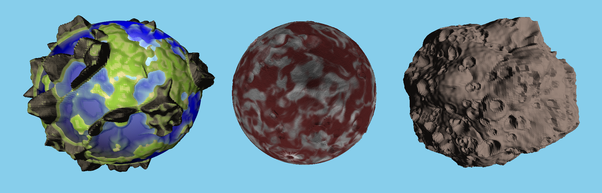
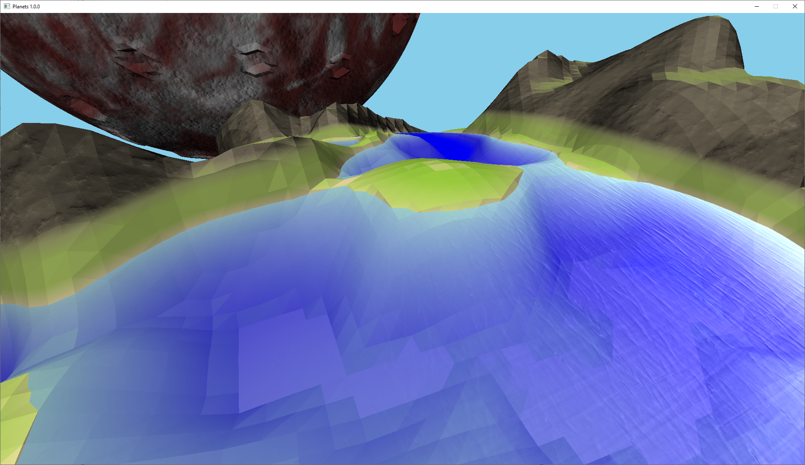
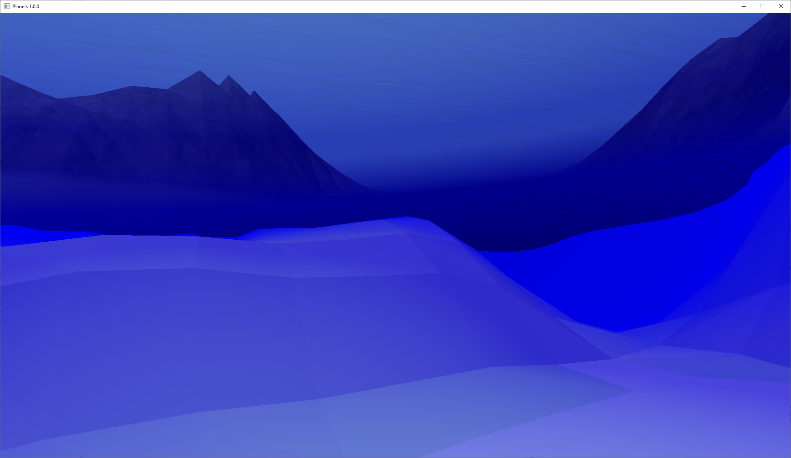
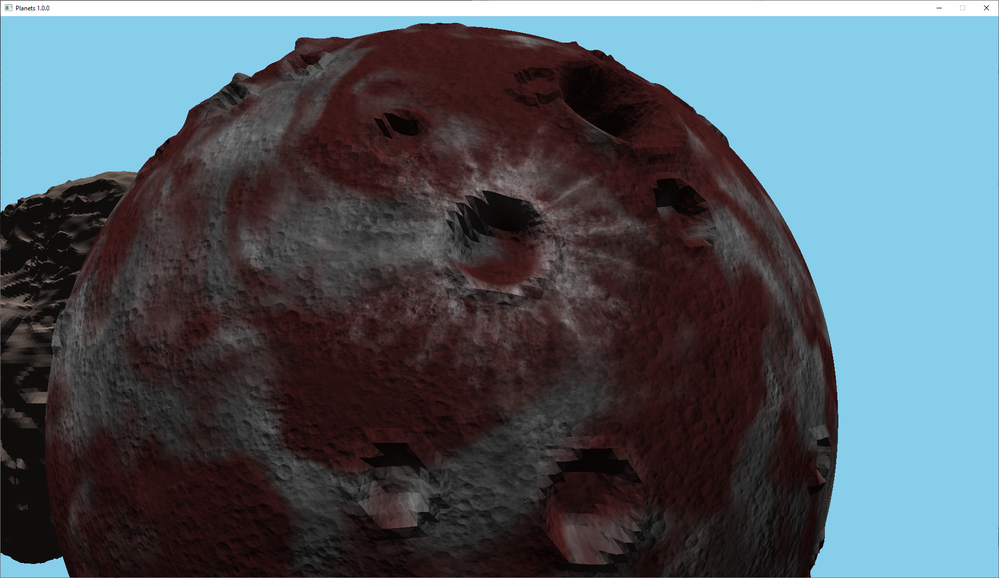
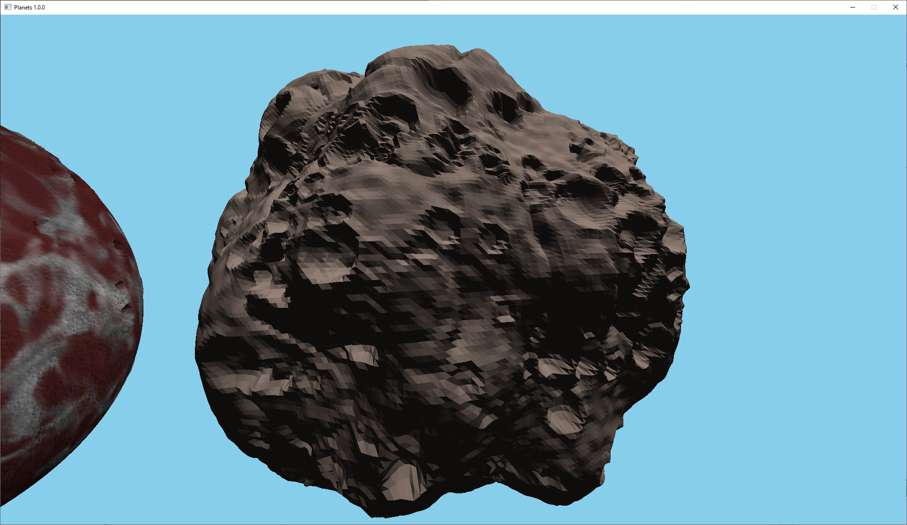
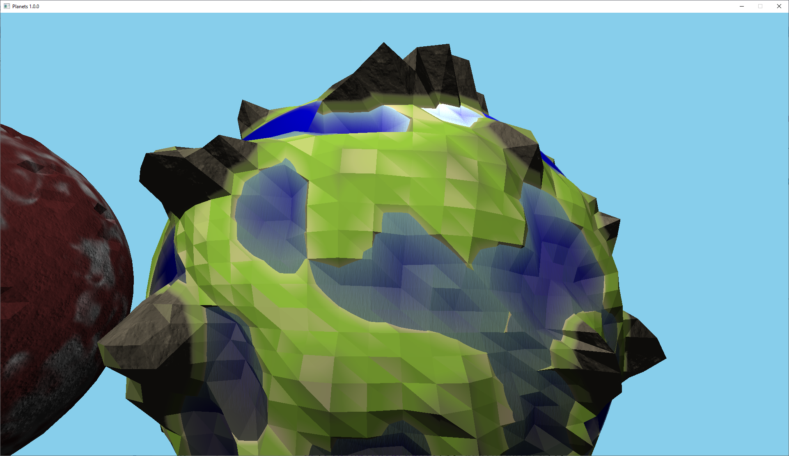
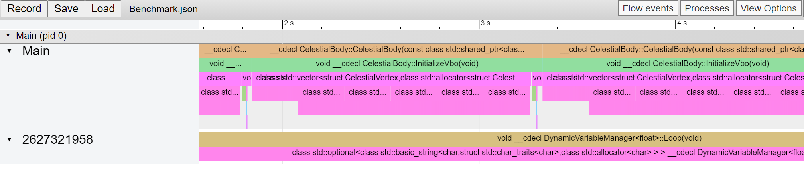

# Planets - Procedural celestial body generation


### Table of contents ###
- [Description](#Description)
- [Screenshots](#Screenshots)
- [Requirements](#Requirements)
- [Compiling](#Compiling)
- [Installing](#Installing)
- [How do I run the installed executable?](#How-do-I-run-the-installed-executable)
- [Controls](#Controls)
- [Tips](#Tips)
- [Where are the commits for the graphics framework?](#Where-are-the-commits-for-the-graphics-framework)

### Description ###
Planets is a demo that showcases procedurally generated celestial bodies. The shapes of the celestial bodies are generated inside a compute shader, for optimal performance, and are controlled by a set of parameters. In the demo, three completely different shaped celestial bodies (a planet, a moon, and an asteroid) have 
been generated by changing these parameters. The user can, with the help of multithreading, update the parameters through the console at runtime, and see the
result almost instantaneously.

### Screenshots ###

Moving ocean waves are simulated by interpolating between two normal maps. Notice how the colour of the water changes, when going from the deeper to the more shallow areas.  


One can descend underwater, since the ocean is rendered using a post-processing effect.  


The red colour of the moon is rendered by using warped perlin noise. We are also interpolating between two normal maps, using more noise, to create the moon-like surface.  


By generating a lot of craters, and deforming the overall shape using perlin noise, one can create this asteroid-like looking celestial body.  


If an even more low poly style is desired, one can lower the resolution of the planet.   


The framework, developed initially for one of my other projects (check out my "Water" repository), supports multithreaded visual benchmarking. To use it, turn on the macro "ENABLE_BENCHMARKING" inside "BenchmarkMacros.h" and use the macro "BENCHMARK" to benchmark a certain scope. To view the benchmarking visually, as above, open Google Chrome, search for "chrome://tracing" in the address bar, and simply drag one of the benchmarks saved in the "Benchmarks" folder on to the screen.

### Requirements ###
- Windows x64
- OpenGL 4.5

### Compiling ###
Step 1  
Starting from the root directory, run the following command (note that you need a compiler that partially supports C++20):
```bash
$ cmake -S . -B Build
```  
Step 2  
Simply open and use the solution that is located inside the root folder.

### Installing ###
Step 1  
Starting from the root directory, run the following commands (note that you need a compiler that partially supports C++20):
```bash
$ cmake -S . -B Build
$ cd Build
$ cpack -G "NSIS"
```
If you desire, you can of course substitute the final command with "make install". If you run CMake with Visual Studio 2019 as your generator, you can skip the last two commands. Simply open the generated solution and build the project named "PACKAGE" instead.

Step 2  
Run the generated installer. 

### How do I run the installed executable? ###
Search for "Planets" inside the Windows search bar and open the shortcut, or, alternatively, navigate to the folder "Planets 1.0.0" and run the executable:
```bash
$ bin/Planets.exe
```
Note that you need to run the application as an administrator, if you intend to save a benchmark or the parameters that you have set for the celestial body generation. At the moment these files are located inside the installed folder, which is most likely located inside the programs folder whose content requires administrative privileges to be written to.

### Controls ###
| Action        | Key           |
| ------------- |:-------------:|
| Forward       | W             |
| Back          | S             |
| Left          | A             |
| Right         | D             |
| Up            | Space         |
| Down          | Shift         |

### Tips ###
- If the demo takes a long time to load (make sure you are running in release), you can lower the resolution of the celestial bodies by increasing the value of the "cellSideLength" argument passed into their constructors.
- When you are using the console to update the parameters, and are asked to type the name of a variable group, you can type the name of any of the files inside the folder "DynamicVariableFiles". When you are asked to type the name of a variable, you can type the name of any of the variables declared inside the chosen file. When asked to type a new value for the chosen variable, you also have the ability to update the variable using your keyboard. Make sure you are in the game window (not the console), and use the keys "left" and "right, to decrease/increase the variable's value. You can also increase/decrease the effect the "left" and "right" keys have, by using the keys "up" and "down" respectively. Note that the celestial bodies actually only get regenerated when you are using the keyboard. Typing into the console updates the value, but does not regenerate the celestial body. Hence, to see the celestial bodies update before your eyes you have to use the keyboard. An excuse for all of these inconveniences is that the ability to dynamically update the variables was initially thought of as a tool that one would only use during development.

### Where are the commits for the graphics framework? ###
I copied the graphics framework from my "Water" repository, so you can view the commits from there:  
https://github.com/Flompey/Water

